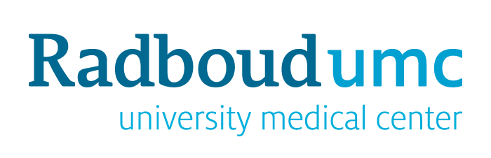
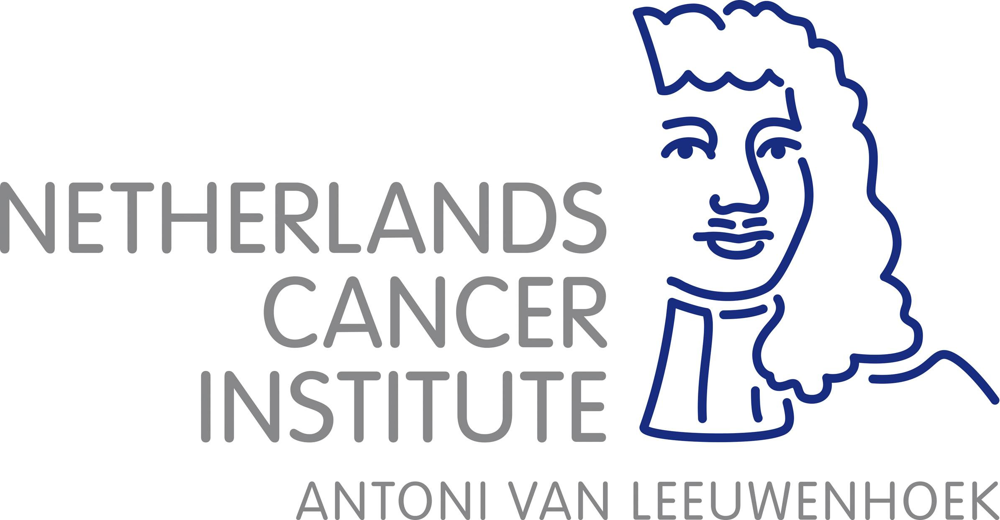

# Seq2Seq: Sequence-to-Sequence Generator

We are committed to exploring the application of synthesis for multi-sequence MRI (also including other modalities such as CT) in clinical settings.

Seq2Seq is a series of dynamic multi-domain models that can translate an arbitrary sequence to a target sequence.
- To learn more information about our work, please refer to our [publications](#publications).
- If you are looking for a straightforward way to resolve image-to-image tasks (e.g., synthesis and segmentation) without much thought, please try our [nnSeq2Seq](#nnseq2seq).

## Publications
If you use Seq2Seq or some part of the code, please cite (see [bibtex](./citations.bib)):

  * Seq2Seq: an arbitrary sequence to a target sequence synthesis, the sequence contribution ranking, and associated imaging-differentiation maps.
  
    **Synthesis-based Imaging-Differentiation Representation Learning for Multi-Sequence 3D/4D MRI**  
Medical Image Analysis.   

  * TSF-Seq2Seq: an explainable task-specific synthesis network, which adapts weights automatically for specific sequence generation tasks and provides interpretability and reliability.
  
    **An Explainable Deep Framework: Towards Task-Specific Fusion for Multi-to-One MRI Synthesis**  
MICCAI2023.   

  * VQ-Seq2Seq: a generative model that compresses discrete representations of each sequence to estimate the Gaussian distribution of vector-quantized common (VQC) latent space between multiple sequences.

    **Non-Adversarial Learning: Vector-Quantized Common Latent Space for Multi-Sequence MRI**
MICCAI2024.   

## nnSeq2Seq (beta)
Referring to [nnU-Net](https://github.com/MIC-DKFZ/nnUNet), we propose nnSeq2Seq, a tool for adaptively training Seq2Seq models with a given dataset. It will analyze the provided training cases and automatically configure a matching synthesis pipeline. No expertise is required on your end! You can easily train the models and use them for your application.

### How to get started?
Read these:
- [Installation instructions](./nnseq2seq/docs/installation_instructions.md)
- [Dataset conversion](./nnseq2seq/docs/dataset_format.md)
- [Usage instructions](./nnseq2seq/docs/how_to_use_nnseq2seq.md)

### Examples
Solution of challenges:
- [MAMA-MIA](./nnseq2seq/docs/challenges/mamamia.md)

## Acknowledgements

## Contact
For any code-related problems or questions please [open an issue](https://github.com/fiy2W/mri_seq2seq/issues/new) or concat us by emails.

- [Ritse.Mann@radboudumc.nl](mailto:Ritse.Mann@radboudumc.nl) (Ritse Mann)
- [taotan@mpu.edu.mo](mailto:taotan@mpu.edu.mo) (Tao Tan)
- [Luyi.Han@radboudumc.nl](mailto:Luyi.Han@radboudumc.nl) (Luyi Han)