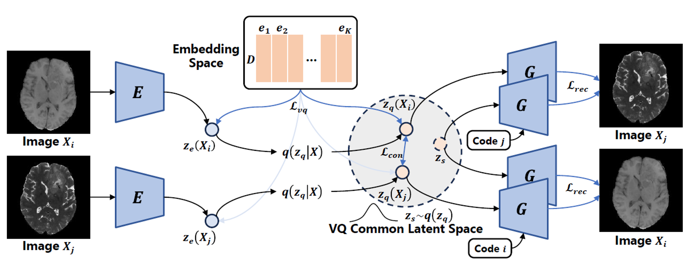
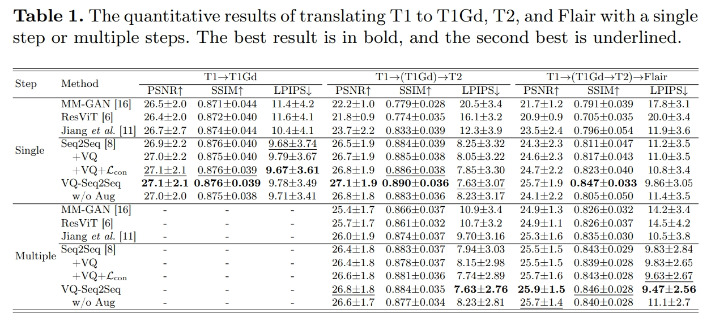

# VQ-Seq2Seq

Pytorch implementation for paper **[Non-Adversarial Learning: Vector-Quantized Common Latent Space for Multi-Sequence MRI](https://doi.org/10.1007/978-3-031-72120-5_45)**

<p align="center">

</p>

## Abstract
> Adversarial learning helps generative models translate MRI from source to target sequence when lacking paired samples. However, implementing MRI synthesis with adversarial learning in clinical settings is challenging due to training instability and mode collapse. To address this issue, we leverage intermediate sequences to estimate the common latent space among multi-sequence MRI, enabling the reconstruction of distinct sequences from the common latent space. We propose a generative model that compresses discrete representations of each sequence to estimate the Gaussian distribution of vector-quantized common (VQC) latent space between multiple sequences. Moreover, we improve the latent space consistency with contrastive learning and increase model stability by domain augmentation. Experiments using BraTS2021 dataset show that our non-adversarial model outperforms other GAN-based methods, and VQC latent space aids our model to achieve (1) anti-interference ability, which can eliminate the effects of noise, bias fields, and artifacts, and (2) solid semantic representation ability, with the potential of one-shot segmentation.

## Training
If you would like to train models with different settings, you can define a `yaml` file by yourself and use the following script.
If you want to train the model with your data, you will likely need to customize your dataloader and training file.
```sh
# Train VQ-Seq2Seq
python publications/src/vq/train/train_brats_vq_seq2seq_2d.py \
    -d cuda:0 \                                                      # set device
    -c publications/config/vq/vqseq2seq_brats_2d_missing_3_256.yaml  # load configuration
```

## Evaluation
### Synthesis Performance
Evaluate the model with three reconstruction metrics: PSNR, SSIM, and LPIPS.

Install package for LPIPS.
```sh
pip install lpips
```

Inference model and save predicted images, then calculate and save the metrics.
```sh
python publications/src/vq/test/test_brats_vq_2d_metrics.py \
    -d cuda:0 \                                                        # set device
    -c publications/config/vq/vqseq2seq_brats_2d_missing_3_256.yaml \  # load configuration
    -l outputs/ckpt/vqseq2seq/brats/2d/ckpt_best.pth \        # load seq2seq weights
    -o outputs/results/vq_seq2seq/brats/2d/                            # direction to save results and metrcis
```

Quantitative results for sequence translation in the paper.

<p align="center">

</p>

## Citation
If this repository is useful for your research, please cite:

```bib
@article{han2024non,
  title={Non-Adversarial Learning: Vector-Quantized Common Latent Space for Multi-Sequence MRI},
  author={Han, Luyi and Tan, Tao and Zhang, Tianyu and Wang, Xin and Gao, Yuan and Lu, Chunyao and Liang, Xinglong and Dou, Haoran and Huang, Yunzhi and Mann, Ritse},
  journal={arXiv preprint arXiv:2407.02911},
  year={2024}
}
```
