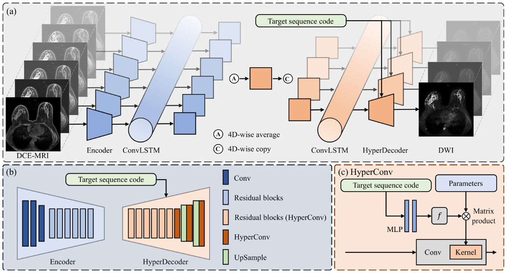
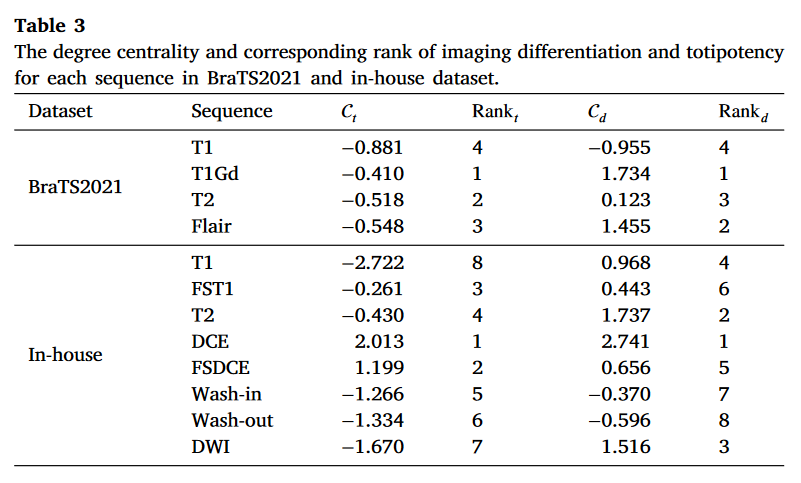
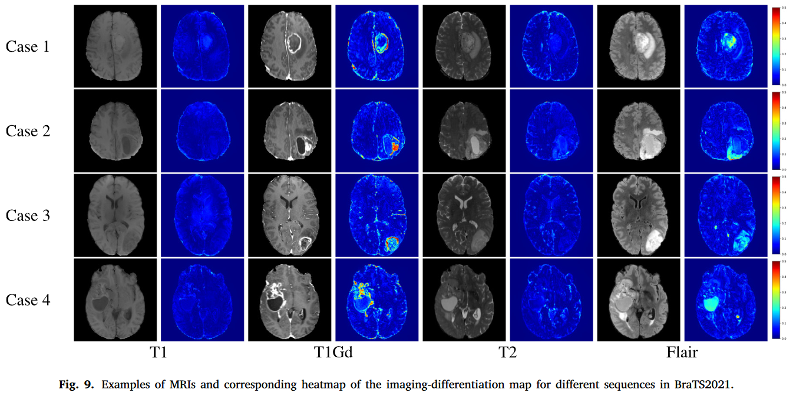

# Seq2Seq

Pytorch implementation for paper **[Synthesis-based Imaging-Differentiation Representation Learning for Multi-Sequence 3D/4D MRI](https://doi.org/10.1016/j.media.2023.103044)**

<p align="center">

</p>

## Abstract
> Multi-sequence MRIs can be necessary for reliable diagnosis in clinical practice due to the complimentary information within sequences. However, redundant information exists across sequences, which interferes with mining efficient representations by modern machine learning or deep learning models. To handle various clinical scenarios, we propose a sequence-to-sequence generation framework (Seq2Seq) for imaging-differentiation representation learning. In this study, not only do we propose arbitrary 3D/4D sequence generation within one model to generate any specified target sequence, but also we are able to rank the importance of each sequence based on a new metric estimating the difficulty of a sequence being generated. Furthermore, we also exploit the generation inability of the model to extract regions that contain unique information for each sequence. We conduct extensive experiments using three datasets including a toy dataset of 20,000 simulated subjects, a brain MRI dataset of 1,251 subjects, and a breast MRI dataset of 2,101 subjects, to demonstrate that (1) our proposed Seq2Seq is efficient and lightweight for complex clinical datasets and can achieve excellent image quality; (2) top-ranking sequences can be used to replace complete sequences with non-inferior performance; (3) combining MRI with our imaging-differentiation map leads to better performance in clinical tasks such as glioblastoma MGMT promoter methylation status prediction and breast cancer pathological complete response status prediction.

## Training
If you would like to train models with different settings, you can define a `yaml` file by yourself and use the following script.
If you want to train the model with your data, you will likely need to customize your dataloader and training file.
```sh
# Seq2Seq
python src/train/seq2seq/train_brats_seq2seq_2d.py \
    -d cuda:0 \                                           # set device
    -c config/seq2seq_brats_2d_missing.yaml \             # load configuration
    -l ckpt/seq2seq/brats/2d/seq2seq_brats_2d_missing.pth # load pre-trained weights or omit this to train from beginning
```

## Evaluation
### Synthesis Performance
Evaluate the model with three reconstruction metrics: PSNR, SSIM, and LPIPS.

Install package for LPIPS.
```sh
pip install lpips
```

Inference model and save predicted images, then calculate and save the metrics.
```sh
python src/seq2seq/test/test_brats_seq2seq_2d_metrics.py \
    -d cuda:0 \                               # set device
    -c config/seq2seq_brats_2d_missing.yaml \ # load configuration
    -l ckpt/seq2seq/brats/2d/ckpt_best.pth \  # load seq2seq weights
    -o results/seq2seq/brats/2d/              # direction to save results and metrcis
```

Quantitative results for sequence translation in the paper.

<p align="center">

</p>

### Sequence Contribution
Calculate $\mathcal{C}_t$ and $\mathcal{C}_d$ to evalate the contribution for each sequence.
```sh
python src/seq2seq/test/cal_brats_seq2seq_2d_contribution.py \
    -f results/seq2seq/brats/2d/result_metrics.csv \ # file path of metrics
    -n 4                                             # number of sequence
```

Contribution for each sequence in the paper.

<p align="center">

</p>

### Imaging-Differentiation Map
Calculate $\mathcal{M}_d$ for each sequence.
```sh
python src/seq2seq/test/pred_brats_seq2seq_2d_md.py \
    -d cuda:0 \                               # set device
    -c config/seq2seq_brats_2d_missing.yaml \ # load configuration
    -l ckpt/seq2seq/brats/2d/ckpt_best.pth \  # load seq2seq weights
    -o results/seq2seq/brats/2d/              # direction to save results
```

Visualization of $\mathcal{M}_d$.

<p align="center">

</p>

## Pre-trained Models
Download the configuration file and corresponding pre-trained weight from [here](https://drive.google.com/drive/folders/1aygogtHrr1WqHSWAgovHUgEpe-4lQd38?usp=sharing).

A list of pre-trained models is available as follows.
| Model | Dataset | Description | Config | Weights |
|:-|:-|:-|:-|:-|
| Seq2Seq | BraTS2021 | Training with incomplete dataset. | [seq2seq_brats_2d_missing.yaml](https://drive.google.com/file/d/1MN1AAMthuClarT16Jiiy9nae0t3NOGQt/view?usp=sharing) | [seq2seq_brats_2d_missing.pth](https://drive.google.com/file/d/1jPlOSpZQs_PMb4nnB89VU59nQ6grhV5f/view?usp=sharing) |
| Seq2Seq | BraTS2021 | Training with complete dataset. | [seq2seq_brats_2d_complete.yaml](https://drive.google.com/file/d/1EOBMEZFXk1jqHstxq208p13YuObED-Ay/view?usp=sharing) | [seq2seq_brats_2d_complete.pth](https://drive.google.com/file/d/19c4F3Pw_T2zye35d9fdwIHs4uKt7QRal/view?usp=sharing) |

## Citation
If this repository is useful for your research, please cite:

```bib
@article{han2024synthesis,
  title={Synthesis-based imaging-differentiation representation learning for multi-sequence 3D/4D MRI},
  author={Han, Luyi and Tan, Tao and Zhang, Tianyu and Huang, Yunzhi and Wang, Xin and Gao, Yuan and Teuwen, Jonas and Mann, Ritse},
  journal={Medical Image Analysis},
  volume={92},
  pages={103044},
  year={2024},
  publisher={Elsevier}
}
```